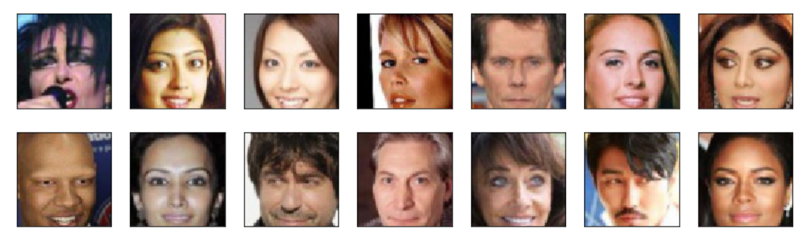
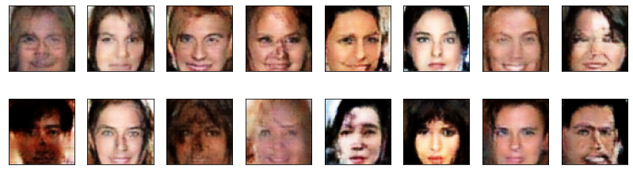

# Generation of Fake Celebrity Faces
## Project Overview

This project leverages Generative Adversarial Networks (GANs) to generate realistic synthetic images using the CelebA dataset. Our objective is to create new faces that closely resemble those of actual celebrities, showcasing the capabilities of modern GAN architectures.
## Dataset
We utilized the CelebA dataset, which contains over 200,000 celebrity images with diverse facial attributes. This dataset was preprocessed to ensure high-quality input for the GAN model.
## Methodology

We implemented the Wasserstein GAN with Gradient Penalty (WGAN-GP) to enhance the stability and performance of the training process. The WGAN-GP framework helps in generating more realistic and high-quality images by improving the training dynamics of the GAN.
## Results
### Original Faces

Below is an example of the original faces from the CelebA dataset:

### Generated Faces

Below are the generated faces after 10 epochs of training with WGAN-GP:

