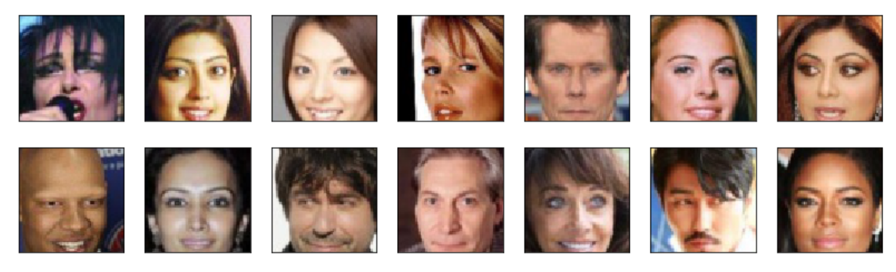
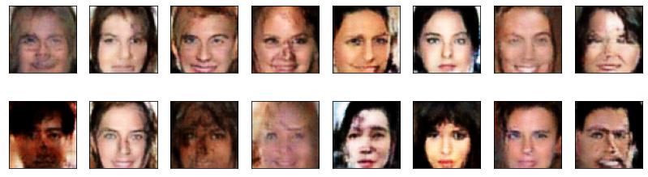

# Face Generation with WGAN-GP (CelebA)

Train a **Wasserstein GAN with Gradient Penalty (WGAN-GP)** to generate **64×64** synthetic face images from CelebA.

## Why this project matters

GANs are notoriously unstable to train. This project focuses on **training stability and experiment hygiene**: WGAN loss + gradient penalty, deterministic seeding, saved checkpoints, and a scriptable training/inference workflow (not just a notebook).

## Results (sample)

**Real samples (preprocessed)**



**Generated samples (10 epochs)**



## Quickstart

### 1) Environment

Option A — pip:

```bash
python -m venv .venv
source .venv/bin/activate
pip install -r requirements.txt -r requirements-dev.txt
pip install -e .
```

Option B — conda:

```bash
conda env create -f environment.yml
conda activate face-gan
pip install -e .
```

Note: **PyTorch is platform/CUDA-specific**. If `pip install torch` fails, install it using the official PyTorch instructions: [PyTorch “Get Started”](https://pytorch.org/get-started/locally/).

### 2) Dataset

This repo expects a directory of images (e.g. `*.jpg`) on disk.

- **Default expected path**: `processed_celeba_small/celeba/`
- If your data lives elsewhere, pass `--data-dir <path>`

CelebA is not included. Download it from the official source and point `--data-dir` to the folder containing the aligned face images.

### 3) Train

```bash
face-gan-train --data-dir processed_celeba_small/celeba/ --epochs 10
```

Artifacts are saved to `runs/<run_name>/`:

- `config.json`
- `metrics.csv`
- `samples/epoch_XXX.png`
- `checkpoints/latest.pt` (and per-epoch checkpoints)

### 4) Generate

```bash
face-gan-generate --checkpoint runs/<run_name>/checkpoints/latest.pt --out outputs/generated.png --num 64
```

## What’s implemented

- **Model**: DCGAN-style generator + conv discriminator (64×64)
- **Objective**: Wasserstein loss + gradient penalty
- **Training**:
  - discriminator steps per generator step (`--d-steps`, default 5)
  - Adam with betas (0.0, 0.9) (common WGAN-GP setting)
  - deterministic seeding (`--seed`, `--deterministic`)
- **Engineering**:
  - scriptable training + inference
  - checkpoints + config snapshots
  - minimal unit tests + CI lint/test

## Key hyperparameters (defaults)

- **latent dim**: 128
- **image size**: 64
- **batch size**: 64
- **lr**: 1e-4
- **d:g steps**: 5:1
- **gradient penalty weight**: 1.0 (`--gp-weight`)

Note: Many WGAN-GP implementations use \( \lambda_{gp}=10 \). This repo defaults to **1.0** to match the original notebook behavior, but you can increase it via `--gp-weight 10`.

## Repo structure

- `Face_Generation.ipynb`: original experimentation notebook
- `src/face_gan/`: reusable training/inference code
- `tests/`: small shape + loss tests
- `.github/workflows/ci.yml`: lint + test
- `MODEL_CARD.md`: intended use + limitations
- `PORTFOLIO_IMPROVEMENT_PLAN.md`: roadmap for further upgrades (FID, tracking, demos)

## Limitations & ethical considerations

- Generated faces can be misused. Keep outputs **clearly labeled as synthetic**.
- Biases in the training data can be reflected in generated samples.
- This model is low-resolution and not suitable for identity-sensitive use cases.

## CV-ready bullets (copy/paste)

- Trained a **WGAN-GP** on CelebA to generate **64×64** synthetic faces; implemented gradient penalty and stabilization-friendly optimization settings in PyTorch.
- Refactored a notebook-only workflow into a **reproducible ML codebase** with CLI training/inference, deterministic seeding, checkpointing, and CI-backed tests.
- Built an end-to-end experimentation loop with saved sample grids per epoch and structured run artifacts (`config.json`, `metrics.csv`, checkpoints).

